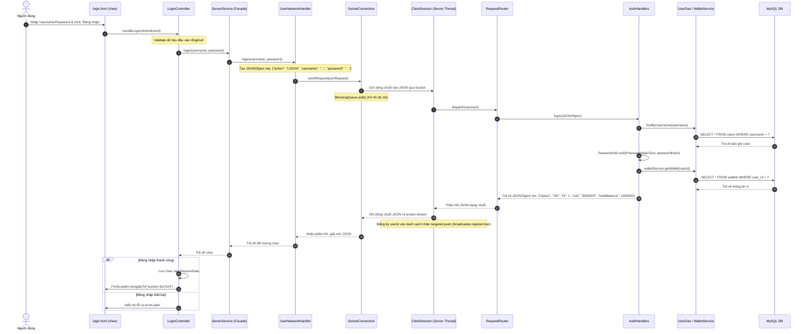
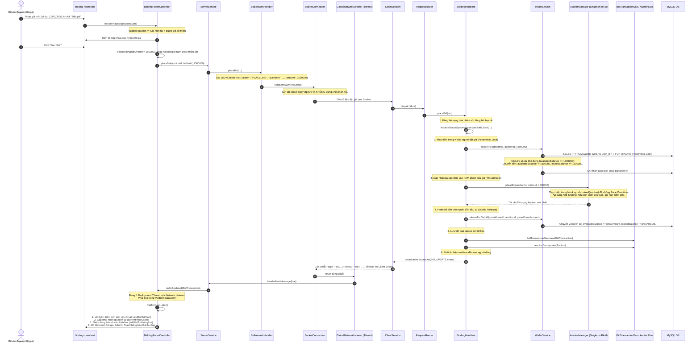
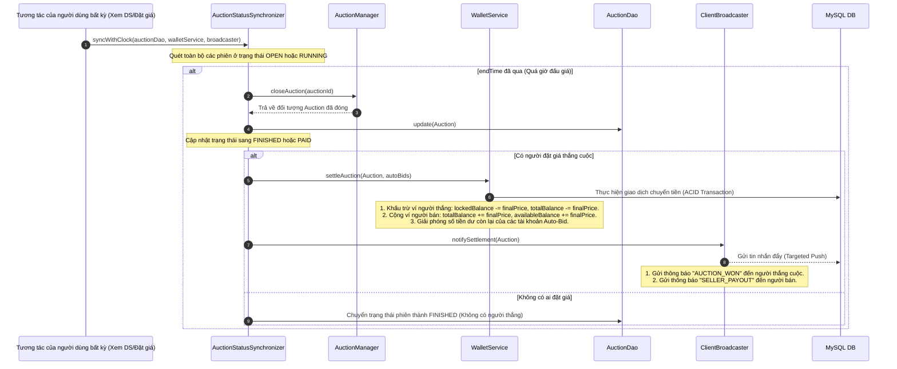

# 📘 Hướng Dẫn Hoạt Động Chi Tiết Của Hệ Thống Đấu Giá Trực Tuyến

Tài liệu này trình bày chi tiết về **kiến trúc luồng dữ liệu, các tầng chức năng, và thứ tự gọi hàm** của hệ thống từ lúc người dùng tương tác trên giao diện Client (JavaFX) cho đến khi dữ liệu được xử lý tại Server (TCP Socket) và cập nhật xuống Database (MySQL), cũng như cơ chế phản hồi Realtime (Observer Pattern).

---

## 1. 🏗️ Tổng Quan Kiến Trúc Hệ Thống (Client-Server Architecture)

Hệ thống được thiết kế theo mô hình **Client-Server độc lập**, giao tiếp thời gian thực thông qua kết nối **TCP Socket** với định dạng gói tin **JSON**.

```mermaid
graph TD
    subgraph Client (JavaFX App)
        View[Giao diện FXML]
        Ctrl[JavaFX Controller]
        Service[ServerService Facade]
        NetHandler[Network Handlers]
        SocketClient[SocketConnection / GlobalListener]
    end

    subgraph Mạng TCP/IP
        TCP[TCP Connection - Port 8888]
    end

    subgraph Server (Java TCP Server)
        Session[ClientSession Thread Pool]
        Router[RequestRouter]
        Handler[Action Handlers]
        ServiceServer[AuctionManager / WalletService]
        DAO[DAO Interfaces & JDBC]
        DB[(MySQL Database)]
    end

    View -->|User Action| Ctrl
    Ctrl -->|Call Service| Service
    Service -->|Delegate| NetHandler
    NetHandler -->|Send JSON Request| SocketClient
    SocketClient <==>|TCP Socket| TCP
    TCP <==>|TCP Socket| Session
    Session -->|Dispatch String| Router
    Router -->|Route Action| Handler
    Handler -->|Execute Business| ServiceServer
    ServiceServer -->|Database Queries| DAO
    DAO <==>|SQL Queries| DB
    
    %% Realtime Push Luồng
    ServiceServer -.->|Broadcast Event| Session
    Session -.->|Targeted Push / Broadcast| SocketClient
    SocketClient -.->|Push Message| Service
    Service -.->|Notify Observer| Ctrl
    Ctrl -.->|Platform.runLater| View
```

---

## 2. 🔄 Trình Tự Hoạt Động Chi Tiết Qua Các Chức Năng Mẫu

### 🌟 CHỨC NĂNG 1: Đăng Nhập Hệ Thống (LOGIN)
*Đặc trưng cho luồng: Yêu cầu đồng bộ (Request-Response) - Client gửi yêu cầu và chờ đợi phản hồi từ Server.*

#### Sơ đồ tuần tự gọi hàm:



---

### ⚡ CHỨC NĂNG 2: Đặt Giá Trực Tiếp (PLACE_BID)
*Đặc trưng cho luồng: Đặt giá bất đồng bộ (Fire-and-Forget) kết hợp xử lý đồng thời (Concurrency), Khoá Ví tiền (Pessimistic Locking) và Phát tin thời gian thực (Realtime Observer Update).*

#### Sơ đồ tuần tự gọi hàm:



---

### 🧠 CHỨC NĂNG 3: Đấu Giá Tự Động (AUTO-BID)
*Cơ chế tự động hóa phức tạp, phối hợp giữa chiến lược đấu giá (Strategy Pattern), hàng đợi ưu tiên (Priority Queue) và xử lý đệ quy.*

```mermaid
flowchart TD
    A[Bắt đầu lượt đấu giá mới] --> B[Người đặt giá thủ công / Tự động khác thành công]
    B --> C[Server lưu BidTransaction mới thành công vào DB]
    C --> D[Gọi AuctionManager.resolveAutoBids#40;auctionId#41;]
    D --> E[Lấy danh sách AutoBidStrategy đã đăng ký]
    E --> F{Có chiến lược tự động nào đang hoạt động và không phải của người vừa dẫn đầu không?}
    
    F -- Không --> G[Kết thúc lượt xử lý, chờ bid tiếp theo]
    F -- Có --> H[Tìm chiến lược AutoBid có độ ưu tiên cao nhất]
    
    Note over H: Độ ưu tiên dựa trên:<br/>1. Giá trị MaxBid cao nhất.<br/>2. Thời gian đăng ký trước (nếu cùng MaxBid).
    
    H --> I[Tính toán bước giá tiếp theo:<br/>nextBid = Math.min#40;currentPrice + increment, maxBid#41;]
    I --> J{Giá tiếp theo có hợp lệ không?<br/>nextBid > currentPrice & <= maxBid}
    
    J -- Không --> K[Vô hiệu hóa AutoBid này] --> F
    J -- Có --> L[Thực hiện đặt giá tự động]
    
    L --> M[Gọi walletService.lockForBid cho người Auto-bid]
    M --> N[Cập nhật Auction State trong RAM]
    N --> O[Hoàn trả ví tiền cho người dẫn đầu trước đó]
    O --> P[Lưu BidTransaction mới tự động vào DB]
    P --> Q[Phát tín hiệu Realtime BID_UPDATE ra toàn hệ thống]
    Q --> D
```

---

### ⏳ CHỨC NĂNG 4: Kết Thúc Phiên & Thanh Toán Đấu Giá (PAID)
*Cơ chế tự động đóng phiên bằng đồng hồ đồng bộ lazy và thanh toán giao dịch tự động.*

#### Quy trình xử lý đóng phiên:



---

## 3. 📂 Vai Trò Cụ Thể Của Từng Tầng Trong Kiến Trúc

### 🔵 PHẦN CLIENT (Giao diện và Điều phối yêu cầu)

1. **Tầng Giao Diện (View - `.fxml`):** 
   - Định nghĩa layout, định dạng thị giác (bảng biểu, các trường nhập liệu, nút bấm, và đồ thị `LineChart`).
2. **Tầng Điều Khiển (Controller - `*Controller.java`):**
   - Lắng nghe hành động người dùng, kiểm tra validate định dạng cơ bản của dữ liệu (không trống, là số hợp lệ...).
   - Thực thi cập nhật giao diện thông qua `Platform.runLater()` khi nhận thông báo bất đồng bộ từ luồng mạng.
3. **Tầng Dịch Vụ Cổng Kết Nối (Facade Service - `ServerService.java`):**
   - Đóng vai trò là đầu mối (Gateway) duy nhất để các controller tương tác với server, giúp che giấu cấu trúc mạng bên dưới.
   - Nhận thông tin trực tiếp từ luồng listener và phân phối sự kiện cho các `AuctionObserver` đang quan sát.
4. **Tầng Xử Lý Mạng (Network Handlers - `*NetworkHandler.java`):**
   - Chuyển đổi dữ liệu đối tượng Java thành định dạng chuỗi JSON thô để gửi qua mạng và ngược lại.
5. **Tầng Kết Nối Thô (Socket Connection - `SocketConnection.java`):**
   - Quản lý vòng đời socket TCP. Khởi động một luồng nền độc lập (`GlobalNetworkListener`) liên tục đọc dữ liệu từ server và đẩy phản hồi về các hàng đợi hoặc trực tiếp qua các callback.

---

### 🟢 PHẦN SERVER (Xử lý Nghiệp vụ và Lưu trữ)

1. **Tầng Giao Tiếp Socket (Network Session - `ClientSession.java`):**
   - Chạy trên một luồng riêng biệt của Thread Pool để quản lý một kết nối client duy nhất, đảm bảo tính song song khi có hàng trăm client truy cập.
2. **Tầng Điều Phối Yêu Cầu (Router - `RequestRouter.java`):**
   - Phân tích trường `action` trong chuỗi JSON nhận được để điều hướng đến đúng Handler chức năng xử lý (Áp dụng Open-Closed Principle).
3. **Tầng Điều Khiển Nghiệp Vụ (Action Handlers - `*Handlers.java`):**
   - Tiếp nhận JSON từ Router, bóc tách các tham số, gọi các dịch vụ nghiệp vụ cần thiết và chuẩn bị JSON phản hồi.
4. **Tầng Dịch Vụ Cốt Lõi (Core Services - `AuctionManager`, `WalletService`):**
   - Chứa toàn bộ logic nghiệp vụ thực tế của hệ thống: Đặt giá, quản lý tự động trả giá, khóa/mở ví tiền, đóng/mở phiên đấu giá.
   - Đảm bảo tính an toàn dữ liệu khi có tranh chấp tài nguyên (Concurrency control & Transaction lock).
5. **Tầng Truy Xuất Dữ Liệu (DAO Layer - `*Dao` & `Jdbc*Dao`):**
   - Thực thi các câu lệnh SQL để đọc/ghi dữ liệu từ Database MySQL. Hoàn toàn cách ly logic nghiệp vụ khỏi câu lệnh SQL.
6. **Cơ Sở Dữ Liệu (Database - MySQL):**
   - Nơi lưu trữ vĩnh viễn dữ liệu người dùng, ví tiền, sản phẩm, và mọi giao dịch đặt giá.
